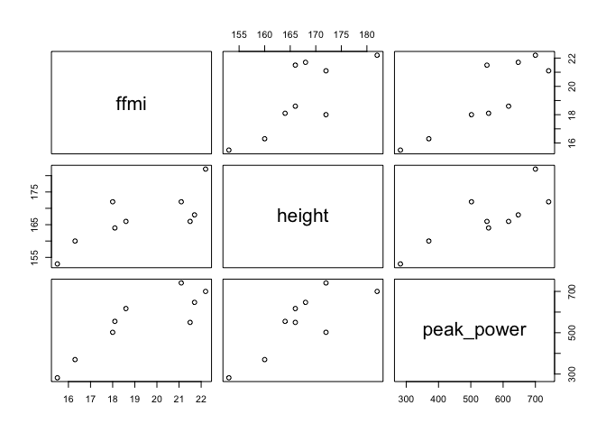

<!-- README.md is generated from README.Rmd. Please edit that file -->

# jhPlayers

<!-- badges: start -->

[](https://CRAN.R-project.org/package=jhPlayers)
[](https://github.com/nim-ach/jhPlayers/actions)
<!-- badges: end -->

The goal of jhPlayers is to provide tools for research reproducibility
and methods for exploratory data analysis.

## Installation

You can install the development version of jhPlayers from
[GitHub](https://github.com/) with:

``` r
# install.packages("devtools")
devtools::install_github("nim-ach/jhPlayers")
```

## Example

This is a basic example which shows you how to print mean and standard
deviation for specific variables:

``` r
library(jhPlayers)

# Compute mean for age, height and weight
colmean_sd(players, c("age", "height", "weight"))
#>      vars     mean_sd
#> 1:    age  15.6 ± 1.9
#> 2: height   167 ± 8.2
#> 3: weight 69.9 ± 15.6
```

We can also compute summary statistics for our data using `summary()`
command:

``` r
summary(players[, 1:4])
#>      sex         age            weight           height   
#>  Female:2   Min.   :13.00   Min.   : 50.80   Min.   :153  
#>  Male  :7   1st Qu.:15.00   1st Qu.: 61.10   1st Qu.:164  
#>             Median :15.00   Median : 64.70   Median :166  
#>             Mean   :15.56   Mean   : 69.88   Mean   :167  
#>             3rd Qu.:16.00   3rd Qu.: 75.00   3rd Qu.:172  
#>             Max.   :20.00   Max.   :105.10   Max.   :182
```

You can also plot the data, for instance let’s plot the relationship
between fat-free mass index (ffmi), height and peak power:



## Citation

To use `jhPlayers` in publications please use:

``` r
citation("jhPlayers")
#> 
#> To cite package 'jhPlayers' in publications use:
#> 
#>   Matías Castillo Aguilar and Cristian Núñez Espinosa (2022).
#>   jhPlayers: Data from the judo-handball players study. R package
#>   version 0.0.0.9000. https://github.com/nim-ach/jhPlayers
#> 
#> A BibTeX entry for LaTeX users is
#> 
#>   @Manual{,
#>     title = {jhPlayers: Data from the judo-handball players study},
#>     author = {Matías {Castillo Aguilar} and Cristian {Núñez Espinosa}},
#>     year = {2022},
#>     note = {R package version 0.0.0.9000},
#>     url = {https://github.com/nim-ach/jhPlayers},
#>   }
```
